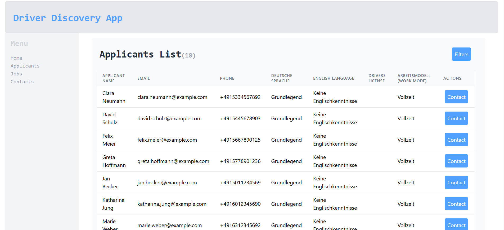
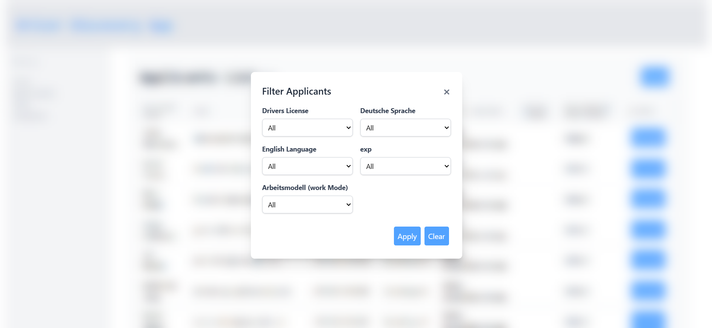
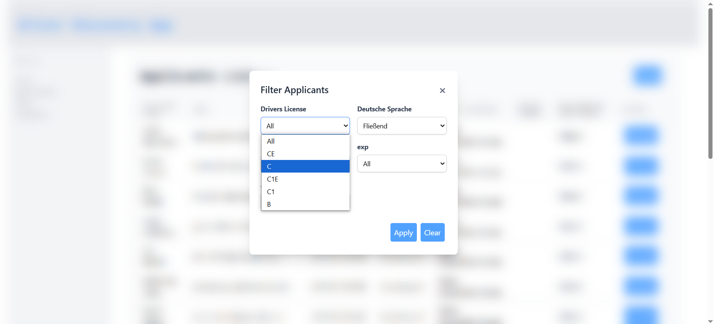

## Short Explanation of the architecture and design

## Components
ca: company api (external)
dds: driver discovery server
ddf: driver discover frontend ui

## Architecture:

- DDS provides 2 APIs.
    1. applicants
    2. contact-one
- DDS streams the data from CA for /applicants API
- DDS, while talking to CA expects huge amounts of records in response, 
    - It should process it as a stream and work in limited memory footprint.
    - Optional to implement pagination over this response
- 
- DDF is a a react SPA, talks to DDS, no authentication yet.
    - Has a page with list of applicants, ability to filter, and see results.
    - for each record in the display, the user is able to contact the applicant with a CTA

## Completed and Remaining work

- Work stated about filters and fetching data from the CA server is completed
- We are able to visualize applicants list, filter them, and contact a selected applicant.
- appropriate test cases added

 Bugs
- on clearing one specific filter in the UI, we need to be able to get the placeholder to appear, which is not working as intended now

### Potential Improvements:

in Frontend:

- Standalone API client with global error handling
- Custom hook for filters to manage its state in a better way
- Global use of toast component
- filters can in future be made to support multiple choices
- in the UI of list, we can show the filters that are applied or just inform user that there are some filters at play here
- a refrest button in the applicants list

General
- standardization of keys in data and case
- could process the CA-response in stream to reduce memory footprint
-

Screenshots:
 

 